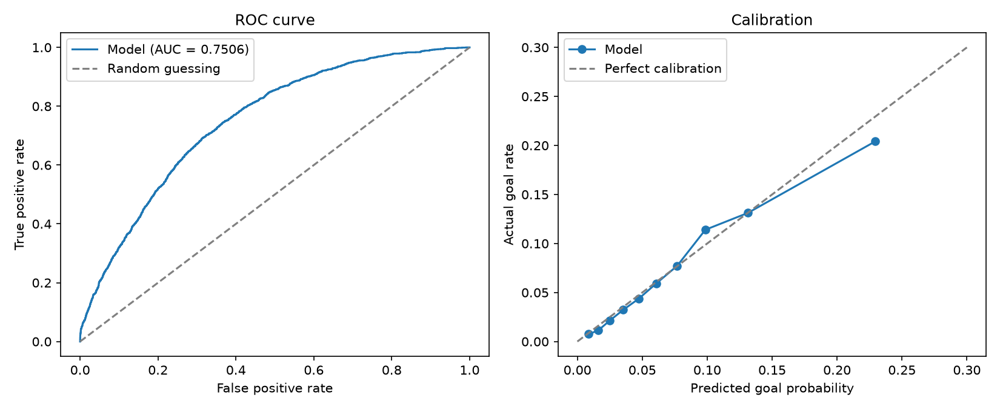

# NHL Expected Goals (xG) Model

A logistic regression model that estimates the probability an NHL shot becomes a goal, using only information available before the shot is taken. Benchmarked against MoneyPuck's xG model.

## Question
How well can shot location and pre-shot context predict goals, and how close can a simple model get to MoneyPuck's xG?

## Data
2025 NHL shot data from [MoneyPuck](https://moneypuck.com/data.htm). Download `shots_2025.csv` and place it in the project folder. The data file is not included in this repo.

## Method
- **Target:** whether the shot was a goal (1) or not (0)
- **Location features:** shot angle adjusted, shot distance, adjusted x and y coordinates, shot location
- **Shot setup:** shot type, shot rush, shot rebound, shot on empty net, shooter position
- **The play just before:** speed, angle, and category of the previous event
- **Fatigue:** time on ice for the shooter, the shooting team, and the defending team since the last faceoff
- **Model:** logistic regression with an 80/20 train/test split. Missing values were filled with the training-set median, and text categories were converted to 0/1 columns
- **Evaluation:** ROC-AUC and a calibration plot, compared against MoneyPuck's `xGoal` on the same test shots

## Results
| Model | ROC-AUC |
|-------|---------|
| Distance and angle only | 0.691 |
| Full feature set (this repo) | 0.7483 |
| MoneyPuck xGoal | 0.7731 |

## What went wrong, and the fixes
1. **Coordinates.** My first version scored 0.554, barely better than random guessing. I had used raw rink positions, so shots at the opposite end of the ice were measured to the wrong net, and my angle was measured from center ice instead of from the net. Using MoneyPuck's adjusted coordinates raised the AUC to 0.691. I confirmed the fix by checking that my calculated distance matched the dataset's built-in `shotDistance`.
2. **Data leakage.** While adding features, my AUC jumped to 1.000 and then 0.79, which was too good to be true. Several columns described what happened *after* the shot (such as whether the goalie froze the puck), and others were outputs of MoneyPuck's own models (columns beginning with `x`). I removed them so the model only uses information known when the shot is taken. The honest score is the one in the table above.

## Limitations and next steps
- Logistic regression can't learn combinations of features on its own; gradient boosting may score higher
- Data from a single season
- The MoneyPuck comparison is a rough guide, since their model was built by MoneyPuck on its own data and feature set
- Next: test whether finishing skill (goals above expected) repeats from one season to the next

## How to run
1. Install the libraries: `pip install -r requirements.txt`
2. Put `shots_2025.csv` in the project folder
3. Run `python xg_model.py`
